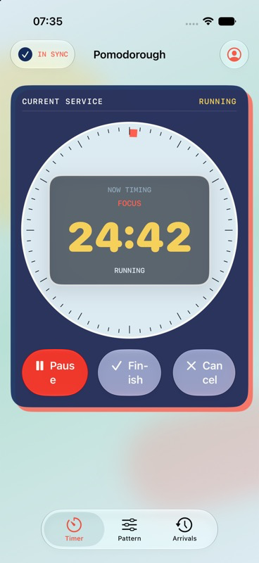

# Pomodorough for Apple Platforms

<p align="center">
  
</p>

<p align="center">
  Native SwiftUI timer for iPhone, iPad, and Mac with durable offline operation and cross-device synchronization.
</p>

<p align="center">
  <a href="https://pomodorough.egigoka.me">Web app</a> |
  <a href="https://github.com/egigoka/pomodorough-server">Server</a> |
  <a href="https://pomodorough.egigoka.me/openapi.yaml">API specification</a>
</p>

Pomodorough brings the project's transit-inspired control-board design to
Apple platforms. Timer actions, tasks, duration preferences, and history remain
usable without an account or network connection. Signing in adds authenticated,
local-first synchronization with the Pomodorough service.

## Highlights

- Native SwiftUI application for iOS, iPadOS, and macOS
- Railway clock interface with adaptive compact and wide layouts
- Liquid Glass controls on current systems and material fallbacks on older ones
- Focus, short-break, and long-break routes from 1 to 180 minutes
- Optional automatic breaks and a long break every fourth completed focus run
- Durable local timer commands, task operations, and duration changes
- Per-focus task assignment with deterministic identities and daily totals
- Google Sign-In with nonce-bound exchange and Keychain token storage
- Server-Sent Event revision hints with periodic synchronization fallback
- AlarmKit completion alerts with local-notification fallback
- VoiceOver labels, Dynamic Type, native controls, and stable list identity

## Platform support

| Target | Minimum version | Interface |
| --- | --- | --- |
| iPhone and iPad | iOS/iPadOS 17 | Adaptive SwiftUI application |
| Mac | macOS 14 | Native SwiftUI application |

The project uses Swift 6 with complete strict-concurrency checking.

## Architecture

| File | Responsibility |
| --- | --- |
| `Sources/AppModel.swift` | Application state, optimistic replay, authentication, and synchronization |
| `Sources/APIClient.swift` | JSON API, token refresh, and revision stream transport |
| `Sources/Models.swift` | Wire contracts, local models, and deterministic reducers |
| `Sources/Views.swift` | Adaptive timer, pattern, task, history, and account interfaces |
| `Tests/` | Reducer, persistence, API-contract, migration, and integration coverage |

Every local action is persisted before it appears in the interface. The app
replays pending operations over the most recent canonical server snapshot,
removing them only after exact acknowledgement. Hybrid logical clocks preserve
ordering when multiple devices work offline.

## Requirements

- Xcode 26.6 or newer
- [XcodeGen](https://github.com/yonaskolb/XcodeGen)
- An Apple development team for physical-device installation

Install XcodeGen with Homebrew:

```sh
brew install xcodegen
```

## Getting started

Generate the Xcode project and open it:

```sh
xcodegen generate
open Pomodorough.xcodeproj
```

Available shared schemes:

| Scheme | Purpose |
| --- | --- |
| `Pomodorough-iOS` | iPhone and iPad application plus unit/integration tests |
| `Pomodorough-macOS` | Native Mac application |

The generated project is checked in for convenience. Run `xcodegen generate`
after changing `project.yml`.

## Build and test

```sh
xcodebuild -project Pomodorough.xcodeproj \
  -scheme Pomodorough-iOS \
  -destination 'platform=iOS Simulator,name=iPhone 17' \
  build

xcodebuild -project Pomodorough.xcodeproj \
  -scheme Pomodorough-iOS \
  -destination 'platform=iOS Simulator,name=iPhone 17' \
  test

xcodebuild -project Pomodorough.xcodeproj \
  -scheme Pomodorough-macOS \
  -configuration Debug \
  build
```

## Configuration

Production API and Google OAuth values are defined in `project.yml`:

| Setting | Purpose |
| --- | --- |
| `GOOGLE_CLIENT_ID` | Google OAuth client accepted by the backend |
| `GOOGLE_REVERSED_CLIENT_ID` | Callback URL scheme used by Google Sign-In |
| `PRODUCT_BUNDLE_IDENTIFIER` | Platform-specific application identity |
| `DEVELOPMENT_TEAM` | Physical-device signing team |

The API base URL is defined by the app's API client. Any replacement Google
client ID must also be accepted by the server's `GOOGLE_NATIVE_CLIENT_IDS`.

## Offline and sync behavior

No account is required for the timer, tasks, history, or preferences. After
sign-in, pending operations synchronize immediately when possible and remain
queued during network loss. SSE revision events prompt low-latency pulls for
changes made by another client; HTTP synchronization remains authoritative.

## Related repositories

- [Server and PWA](https://github.com/egigoka/pomodorough-server)
- [Android](https://github.com/egigoka/pomodorough-android)
- [Linux](https://github.com/egigoka/pomodorough-linux)
